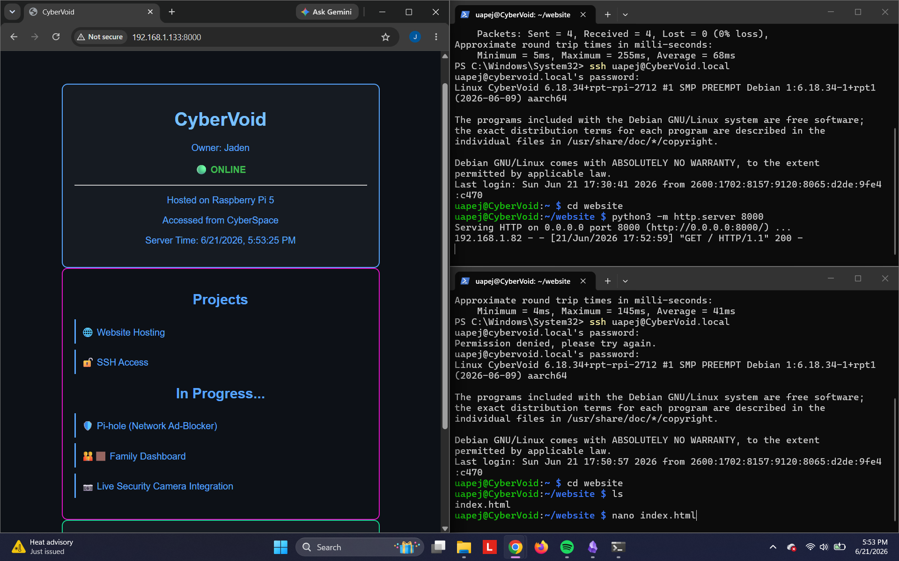
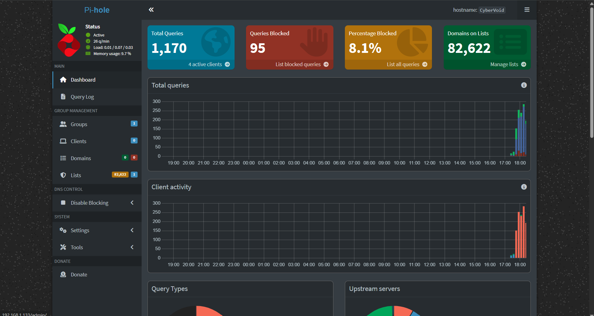

# CyberVerse

Personal collection of cybersecurity, networking, Linux, Raspberry Pi, and automation projects.

## CyberSpace

Where the magic happens. Thinkpad used to:
- Complete THM labs/ modules
- Study for Sec+ through videos/ notetaking/ hands-on learning
- Remotely access Raspberry Pi 5
- Run VMs

## Current Projects

### CyberVoid Website

Created a websited hosted on Raspberry Pi available throughout my network

[CyberSite Documentation](projects/cybersite.md)

### Pi-Hole Deployment

Configure Pi-Hole as a network-wide DNS and DHCP server on Raspberry Pi

[Pi Hole Setup](projects/pihole.md)

### Home Network Map

A map of my devices on my home network

[Home Network Map](projects/networkmap.jpg)

## Planned Projects

- Air Quality Monitor
- Pi-hole Network Ad Blocking
- Family Dashboard
- Home Automation

## Screenshots

Built by Jaden Harris
